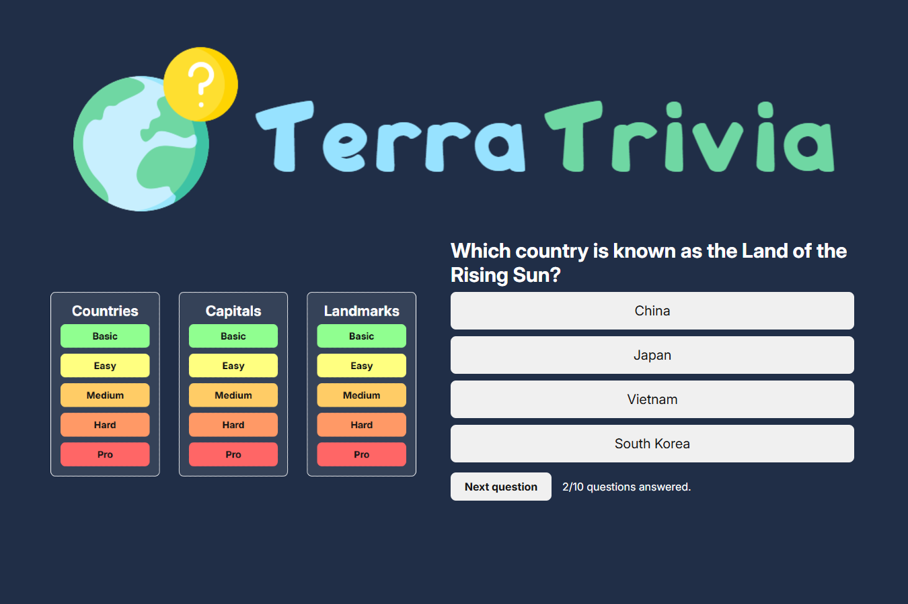

# 🌍 TerraTrivia

**TerraTrivia** is a geography quiz game where you can test your knowledge about the world!  
Built with **HTML**, **CSS**, and **JavaScript**, the game features a **responsive design** that adapts to desktop, tablet, and mobile – making it accessible to everyone.

Visit the site to test your geography knowledge here:  
**[www.terratrivia.vercel.app](https://terratrivia.vercel.app/)** 🎉

## 🧠 About the Game

The questions are divided into **three categories**:

- Countries  
- Capitals  
- Landmarks  

Each category has **five difficulty levels**, resulting in a total of **150 questions** that increase in difficulty to keep the game engaging.

## ▶️ How It Works

1. Choose a category and difficulty level.
2. The game loads **10 questions** from a JSON file.
3. Each question has four answer choices.
4. You can select an answer or skip the question.
5. Once an answer is chosen:
   - Your choice is visually marked.
   - The correct answer turns **green**, while incorrect ones turn **red**.
   - You earn points for correct answers.
6. After 10 questions, you’ll see your **results summary**.
7. You can replay the same level or return to the main menu to choose a new one.

## 🚀 Have fun!
**[www.terratrivia.vercel.app](https://terratrivia.vercel.app/)**

